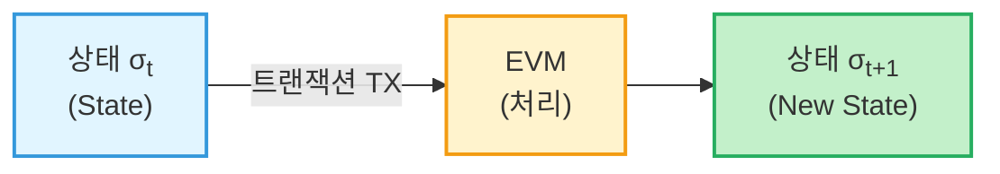
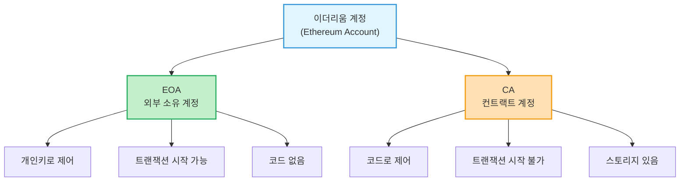
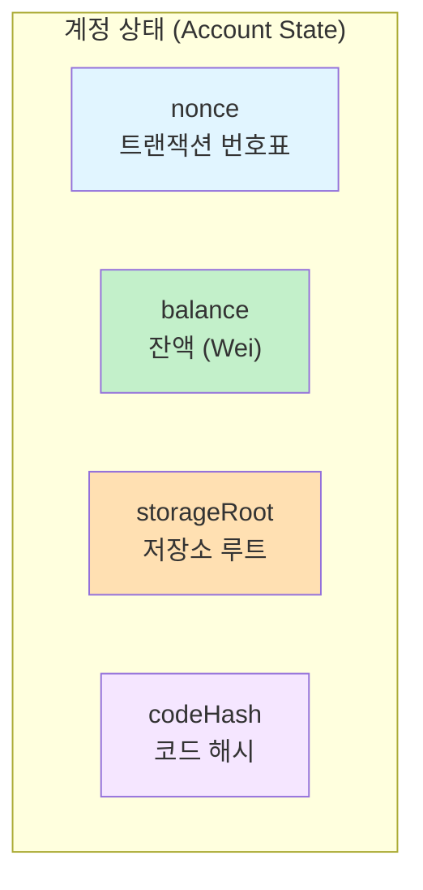
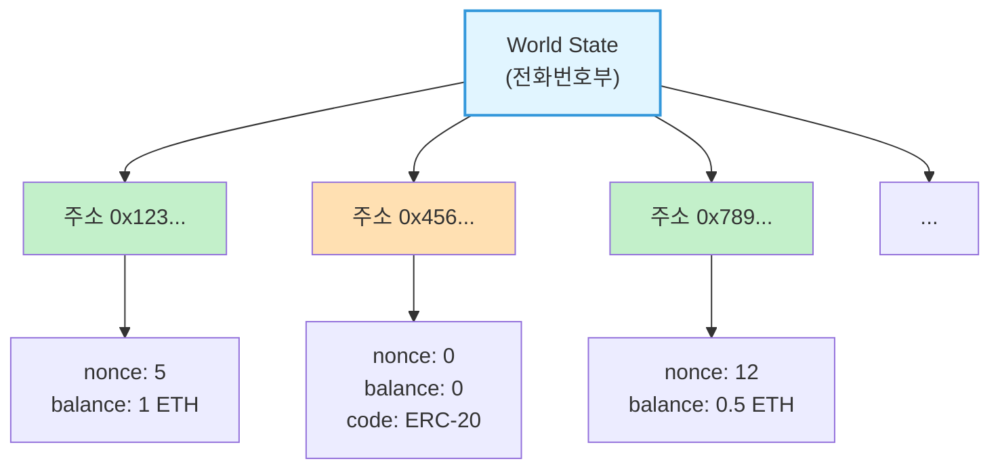

<!-- _class: title -->
# 1주차: State/Account

이더리움 구조, 계정 시스템, World State

---

## 학습 목표

이 주차를 마치면:

- 이더리움의 **상태 머신** 개념을 설명할 수 있습니다
- **EOA**와 **CA**의 차이를 구분할 수 있습니다
- **World State**의 구조를 이해합니다
- 계정 상태의 4가지 필드를 알 수 있습니다

---

## 이더리움이란?

> "이더리움은 **상태 머신(State Machine)** + **분산 네트워크**입니다"

### 핵심 아이디어

- 모든 참여자가 **같은 상태**를 공유합니다
- **트랜잭션**이 상태를 변경합니다
- 변경은 **원자적(atomic)**입니다 - 전부 성공하거나 전부 실패

---

## 상태 머신이란?

일상 비유: **ATM 기계**를 떠올려보세요

| 입력 | 현재 상태 | 출력 | 새로운 상태 |
|------|-----------|------|-------------|
| 5만원 출금 요청 | 잔액 10만원 | 5만원 현금 | 잔액 5만원 |
| 3만원 입금 | 잔액 5만원 | 입금 완료 | 잔액 8만원 |

> ATM도 상태 머신입니다. 이더리움도 마찬가지!

---

<!-- _class: diagram -->
## 이더리움 상태 전이



**상태 전이 함수:** `Y(S, TX) = S'`

---

## 상태 전이의 특징

### 원자성 (Atomicity)

트랜잭션은 **전부 성공**하거나 **전부 실패**합니다

```
송금 실패 시:
  - 보내는 사람 잔액: 변경 없음
  - 받는 사람 잔액: 변경 없음
  - 가스비만 소모됨
```

### 결정론적 (Deterministic)

같은 입력 = 같은 결과 (모든 노드가 동일한 상태 도달)

---

## 이더리움의 두 가지 계정

이더리움에는 두 종류의 계정이 있습니다

| 구분 | EOA | CA |
|------|-----|-----|
| 이름 | Externally Owned Account | Contract Account |
| 한국어 | 외부 소유 계정 | 컨트랙트 계정 |
| 비유 | **내 지갑** | **자동 금고** |
| 제어 | 개인키(Private Key) | 코드(Smart Contract) |

---

<!-- _class: diagram -->
## 계정 유형 비교



---

## EOA: 외부 소유 계정

### "내 지갑" - 나만 접근할 수 있습니다

**특징:**
- **개인키(Private Key)**를 가집니다
- **트랜잭션을 시작**할 수 있습니다
- 코드가 없습니다 (스마트 컨트랙트 아님)

**예시:**
- MetaMask 지갑
- Hardware Wallet (Ledger, Trezor)
- 거래소 개인 계정

---

## CA: 컨트랙트 계정

### "자동 금고" - 규칙대로 동작합니다

**특징:**
- **코드(Smart Contract)**로 제어됩니다
- 트랜잭션을 **시작할 수 없습니다** (반드시 EOA가 호출)
- **스토리지(Storage)**를 가집니다

**예시:**
- Uniswap 컨트랙트
- ERC-20 토큰 컨트랙트
- NFT 컨트랙트 (ERC-721)

---

## 계정 상태 (Account State)

모든 계정은 **4가지 정보**를 가집니다



---

## 계정 상태 필드 상세

### 1. nonce (논스)

- **EOA:** 보낸 트랜잭션 수
- **CA:** 생성한 컨트랙트 수
- 비유: **트랜잭션 번호표** (순서 보장)

### 2. balance (잔액)

- 계정이 보유한 **Wei** 양
- 1 ETH = 10^18 Wei

---

## 계정 상태 필드 상세 (계속)

### 3. storageRoot (저장소 루트)

- **CA만 해당** (EOA는 비어있음)
- 컨트랙트 저장소의 Merkle Patricia Trie 루트
- 비유: **금고 열쇠** (저장된 데이터 접근)

### 4. codeHash (코드 해시)

- **CA:** 컨트랙트 코드의 해시값
- **EOA:** 빈 문자열의 해시 (Keccak256)
- 비유: **규칙서 지문** (코드 식별)

---

## 계정 정보 비유 정리

| 필드 | 비유 | 설명 |
|------|------|------|
| nonce | 번호표 | 트랜잭션 순서 보장 |
| balance | 잔액 | 보유 이더 (Wei) |
| storageRoot | 금고 열쇠 | 저장된 데이터 접근 |
| codeHash | 규칙서 지문 | 컨트랙트 코드 식별 |

> EOA는 은행 계좌 + 신분증
> CA는 은행 계좌 + 신분증 + 금고 + 규칙서

---

## World State (월드 스테이트)

### "전체 계정의 현재 상태"

- 모든 계정의 **주소 -> 상태** 매핑
- **Merkle Patricia Trie(MPT)** 구조로 저장
- 비유: **거대한 전화번호부**

```
World State = {
  0x123...abc: { nonce: 5, balance: 1ETH, ... },
  0x456...def: { nonce: 0, balance: 0, codeHash: 0x... },
  ...
}
```

---

<!-- _class: diagram -->
## World State 구조



---

## MPT (Merkle Patricia Trie) 미리보기

### 왜 MPT를 사용하나요?

1. **빠른 검색:** 주소로 계정 상태 빠르게 찾기
2. **효율적 저장:** 공간 절약 (Patricia)
3. **변조 방지:** 해시로 검증 (Merkle)

> 4주차에서 자세히 배웁니다!

---

<!-- _class: summary -->
## 핵심 정리

**이더리움 = 상태 머신**
- 트랜잭션이 상태를 변경합니다
- 변경은 원자적(atomic)입니다

**두 가지 계정**
- EOA: 개인키로 제어, 트랜잭션 시작 가능
- CA: 코드로 제어, 트랜잭션 시작 불가

**계정 상태 4가지**
- nonce, balance, storageRoot, codeHash

---

<!-- _class: summary -->
## 다음 주 예고

### 2주차: Transaction/Signature

- 트랜잭션은 어떻게 구성되나요?
- 서명(Signature)은 어떻게 동작하나요?
- 가스(Gas)는 무엇인가요?

**준비물:** 1주차 내용 복습, 개인키/공개키 개념

---

## 참고 자료

### 이번 주 학습 자료
- [explanation.md](./explanation.md) - 초보자를 위한 상세 설명
- [용어 사전](../../resources/glossary.md) - 핵심 용어 정리

### 외부 참고 자료
- [Ethereum Whitepaper](https://ethereum.org/whitepaper)
- [Ethereum.org - Accounts](https://ethereum.org/developers/docs/accounts)

### 질문이 있으신가요?
Bay Slack #ethereum-questions 채널에 올려주세요!
