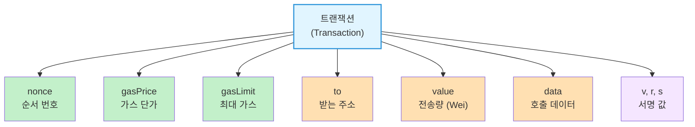
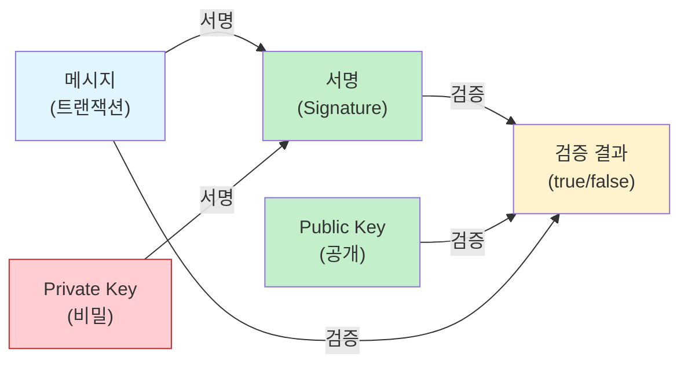
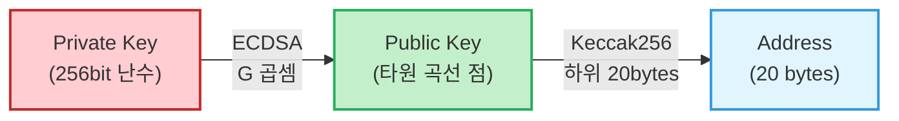
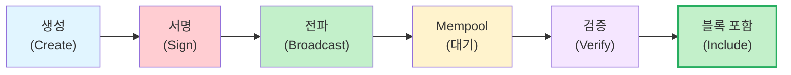

<!-- _class: title -->
# 2주차: Transaction/서명

트랜잭션, ECDSA, 키 페어

---

## 학습 목표

이 주차를 마치면:

- **트랜잭션 구조**와 각 필드의 역할을 이해합니다
- **디지털 서명**의 원리 (ECDSA)를 설명할 수 있습니다
- **Private/Public Key** 관계를 이해합니다
- **보안:** Private Key 관리의 중요성을 알게 됩니다

---

## 트랜잭션이란?

### 일상 비유: 은행 송금 지시서

은행에서 송금할 때 작성하는 **송금 지시서**를 떠올려보세요:

| 송금 지시서 | 트랜잭션 |
|-------------|----------|
| 보내는 사람 | from |
| 받는 사람 | to |
| 금액 | value |
| 수수료 | gas |
| 서명 | signature |

> 트랜잭션 = 이더리움 네트워크에 보내는 **서명된 송금 지시서**

---

<!-- _class: diagram -->
## 트랜잭션 필드 구조



---

## 트랜잭션 필드 상세

### 핵심 필드 설명

| 필드 | 역할 | 비유 |
|------|------|------|
| **nonce** | 트랜잭션 순서 번호 | 대기 번호표 |
| **gasPrice** | 가스 1단위 가격 | 휘발유 리터당 가격 |
| **gasLimit** | 최대 사용 가스량 | 주유 예산 |
| **to** | 받는 주소 | 수취인 계좌번호 |
| **value** | 전송할 ETH (Wei) | 송금 금액 |
| **data** | 컨트랙트 호출 데이터 | 부가 메시지 |

---

## nonce: 왜 필요한가?

### 문제: 트랜잭션 재사용 공격

공격자가 당신의 송금 트랜잭션을 **복사해서 재전송**하면?

### 해결: nonce로 순서 보장

```
nonce = 0: 첫 번째 트랜잭션
nonce = 1: 두 번째 트랜잭션
nonce = 2: 세 번째 트랜잭션
```

> 같은 nonce는 **한 번만** 처리됩니다
> 순서대로 처리되어 재사용 공격 방지!

---

## 디지털 서명이란?

### 일상 비유: 복제 불가능한 도장

**문제:** 온라인에서 어떻게 "본인"임을 증명하나요?

**해결:** 디지털 서명 = **나만 만들 수 있고, 누구나 확인할 수 있는 증명**

| 일반 도장 | 디지털 서명 |
|-----------|-------------|
| 복제 가능 | 복제 불가능 |
| 위조 쉬움 | 위조 불가능 |
| 한 종류 | 메시지마다 다름 |

---

<!-- _class: diagram -->
## 서명과 검증 흐름



**서명:** Private Key + 메시지 -> 서명 생성
**검증:** Public Key + 메시지 + 서명 -> 본인 확인

---

## 왜 서명이 필요한가?

### 세 가지 보장

1. **인증 (Authentication)**
   - 트랜잭션이 **계정 소유자**로부터 왔음을 증명

2. **무결성 (Integrity)**
   - 트랜잭션이 **변조되지 않았음**을 보장

3. **부인 방지 (Non-repudiation)**
   - 서명한 사람은 나중에 **부인할 수 없음**

---

## ECDSA란?

### Elliptic Curve Digital Signature Algorithm

이더리움이 사용하는 서명 알고리즘입니다.

**특징:**
- **secp256k1** 타원 곡선 사용
- 비트코인과 동일한 알고리즘
- 짧은 키로 높은 보안 (256bit = RSA 3072bit 수준)

> 수학적 원리는 복잡하지만, 사용법은 간단합니다!

---

<!-- _class: diagram -->
## 키 유도 과정



**중요:**
- Private Key -> Public Key: **가능** (수학적 계산)
- Public Key -> Private Key: **불가능** (역계산 불가)

---

## 키 페어 비유 정리

| 구분 | Private Key | Public Key | Address |
|------|-------------|------------|---------|
| 비유 | 금고 열쇠 | 신분증 | 계좌번호 |
| 공개 여부 | 절대 비밀 | 공개 가능 | 공개 |
| 역할 | 서명 생성 | 서명 검증 | 식별자 |
| 분실 시 | 복구 불가 | 재생성 가능 | 재생성 가능 |

> **기억하세요:** Private Key를 잃으면 **모든 것을 잃습니다**

---

## 트랜잭션 수명 주기

### 트랜잭션이 처리되는 과정

1. **생성:** 사용자가 트랜잭션 데이터 구성
2. **서명:** Private Key로 서명 추가
3. **전파:** 노드 네트워크에 브로드캐스트
4. **검증:** 각 노드가 서명과 nonce 확인
5. **포함:** 블록에 포함되어 확정

---

<!-- _class: diagram -->
## 트랜잭션 생명 주기



---

## Mempool과 Gas

### Mempool: 트랜잭션 대기실

- 아직 블록에 포함되지 않은 트랜잭션들
- **Gas Price**가 높은 트랜잭션이 먼저 처리됨

### Gas 우선순위

```
Gas Price 높음 = 빨리 처리
Gas Price 낮음 = 느리게 처리 (또는 드롭)
```

> 마치 **택시 할증 요금** 같아요 - 더 내면 더 빨리!

---

<!-- _class: security -->
## Private Key 보안

### 왜 중요한가?

**Private Key 노출 = 완전한 자산 탈취**

- 누군가 당신의 Private Key를 알면:
  - 모든 ETH와 토큰을 **즉시** 전송 가능
  - **되돌릴 방법 없음** (블록체인은 영구적)
  - 법적 구제도 어려움

> **은행 계좌와 다릅니다:** 은행은 이상 거래 취소 가능, 블록체인은 불가능

---

<!-- _class: security -->
## 실제 사례: Ronin Bridge (2022)

### $625M (약 8,000억원) 피해

**무슨 일이 있었나?**
- Axie Infinity 게임의 Ronin Bridge 해킹
- **Private Key 5개**가 탈취됨 (9개 중 5개 = 과반)
- 공격자가 자유롭게 자금 인출

**원인:**
- 퇴사 직원의 키 비활성화 미흡
- 사회공학 공격 (가짜 채용 제안)

---

<!-- _class: security -->
## Private Key 보안 수칙

### 반드시 지켜야 할 것들

| 하지 마세요 | 대신 이렇게 하세요 |
|------------|-------------------|
| 스크린샷 저장 | 오프라인 종이 백업 |
| 클라우드 저장 | Hardware Wallet |
| 메신저로 전송 | 직접 입력만 |
| 누구에게도 공유 | 혼자만 알기 |

**추가 권장:**
- Hardware Wallet 사용 (Ledger, Trezor)
- Multi-sig 지갑 (여러 키 필요)
- [OWASP SCSTG](https://github.com/OWASP/owasp-scstg) 보안 가이드 참고

---

<!-- _class: summary -->
## 핵심 정리

**트랜잭션**
- 서명된 상태 변경 요청
- nonce로 순서 보장, gas로 수수료 지불

**디지털 서명 (ECDSA)**
- Private Key로 서명, Public Key로 검증
- 인증, 무결성, 부인 방지 보장

**키 페어**
- Private -> Public -> Address (단방향)
- Private Key 분실/노출 = 복구 불가

---

<!-- _class: summary -->
## 다음 주 예고

### 3주차: EVM/스마트컨트랙트

- EVM은 어떻게 동작하나요?
- 바이트코드란 무엇인가요?
- Storage, Memory, Stack의 차이는?
- **보안:** Reentrancy 공격과 방어

**준비물:** 2주차 내용 복습, 트랜잭션/서명 개념 이해

---

## 참고 자료

### 이번 주 학습 자료
- [explanation.md](./explanation.md) - 초보자를 위한 상세 설명
- [용어 사전](../../resources/glossary.md) - 핵심 용어 정리

### 외부 참고 자료
- [Ethereum.org - Transactions](https://ethereum.org/developers/docs/transactions)
- [ECDSA 설명](https://en.wikipedia.org/wiki/Elliptic_Curve_Digital_Signature_Algorithm)
- [OWASP SCSTG](https://github.com/OWASP/owasp-scstg) - 스마트 컨트랙트 보안 가이드

### 질문이 있으신가요?
Bay Slack #ethereum-questions 채널에 올려주세요!
