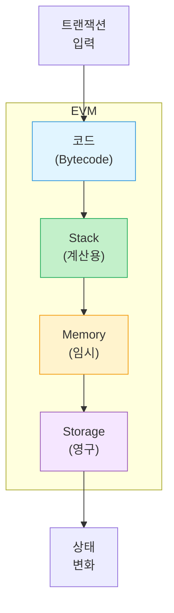
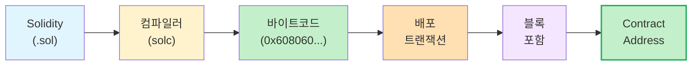
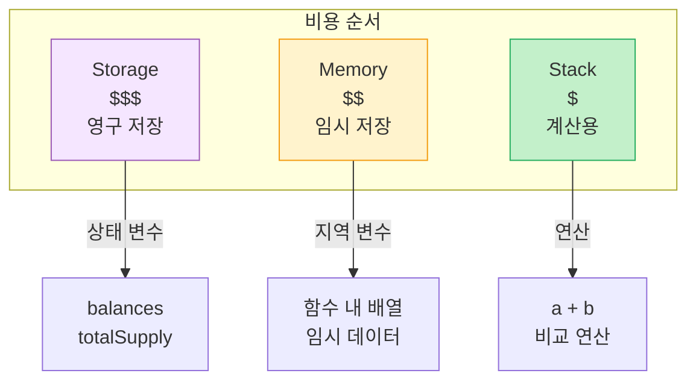
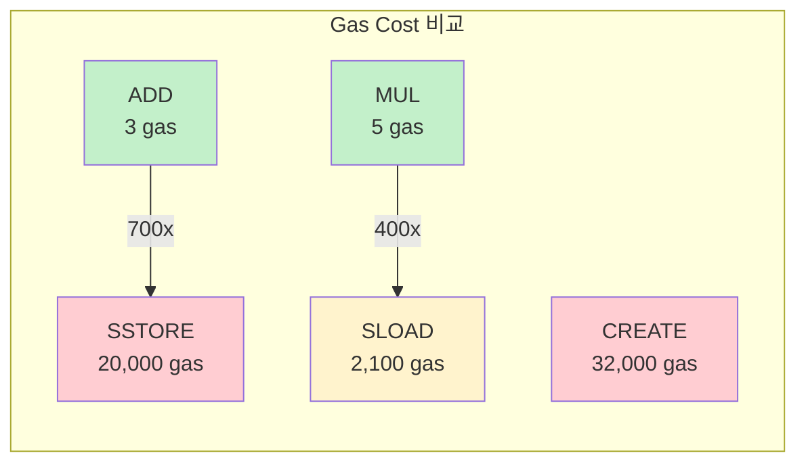
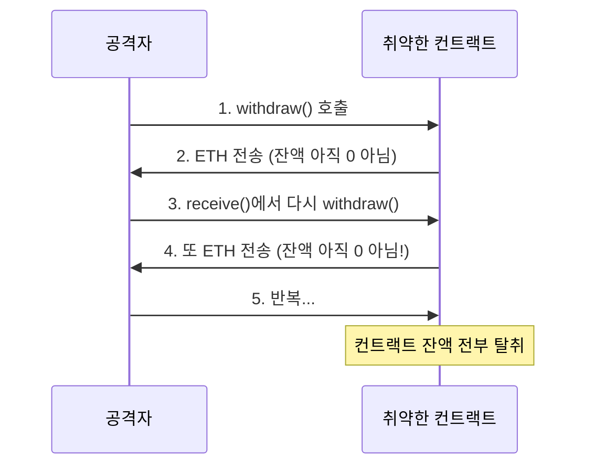

<!-- _class: title -->
# 3주차: EVM/스마트컨트랙트

바이트코드, 스토리지, 가스

---

## 학습 목표

이 주차를 마치면:

- **EVM**의 역할과 동작 방식을 이해합니다
- **컴파일**과 **바이트코드**를 설명할 수 있습니다
- **Storage, Memory, Stack**의 차이를 구분합니다
- **Gas** 메커니즘을 이해합니다
- **보안:** Reentrancy, Storage 취약점을 알게 됩니다

---

## EVM이란?

### 이더리움의 가상 컴퓨터

**EVM** = Ethereum Virtual Machine (이더리움 가상 머신)

> "전 세계 수천 개 노드가 돌리는 **하나의 공용 컴퓨터**"

**특징:**
- 모든 노드가 **같은 결과** 도출 (결정론적)
- 운영체제와 **무관** (Windows, Mac, Linux)
- 스마트 컨트랙트 **격리 실행** (샌드박스)

---

<!-- _class: diagram -->
## EVM 아키텍처



---

## 결정론적 실행

### "같은 입력 = 같은 결과"

전 세계 모든 노드가 **100% 동일한 결과**를 얻습니다.

**이를 위한 제약:**
- 랜덤 함수 없음 (대신 block.timestamp 등 사용)
- 네트워크 요청 불가 (외부 API 호출 X)
- 파일 시스템 접근 불가

> 비유: **동일한 계산기**에 같은 숫자를 누르면 같은 답!

---

## 스마트 컨트랙트 배포

### Solidity에서 블록체인까지

1. **Solidity 코드** 작성 (사람이 읽기 쉬움)
2. **컴파일러(solc)**가 바이트코드로 변환
3. 바이트코드를 담은 **트랜잭션** 전송
4. 블록에 포함되면 **컨트랙트 생성**
5. 고유한 **Contract Address** 부여

---

<!-- _class: diagram -->
## 배포 과정 흐름



---

## 바이트코드란?

### EVM이 이해하는 기계어

```solidity
// Solidity (사람용)
function add(uint a, uint b) public pure returns (uint) {
    return a + b;
}
```

컴파일 후:
```
// 바이트코드 (EVM용)
0x6080604052348015600f57600080fd5b50607680601d...
```

**Opcode:** 바이트코드의 각 명령어 (ADD, MUL, PUSH, SSTORE 등)

---

## Contract Address 생성

### 컨트랙트도 주소가 있습니다

**주소 계산 방식:**
```
Address = keccak256(sender, nonce)[-20bytes]
```

- **sender:** 배포자의 주소
- **nonce:** 배포자의 트랜잭션 번호

> 컨트랙트 주소는 **예측 가능**합니다!
> CREATE2는 다른 방식 (salt 사용)

---

## Storage, Memory, Stack

### EVM의 세 가지 저장 공간

| 구분 | 비유 | 지속성 | 비용 |
|------|------|--------|------|
| **Storage** | 금고 | 영구 | 매우 비쌈 |
| **Memory** | 메모장 | 함수 실행 중 | 저렴 |
| **Stack** | 계산기 | 연산 중 | 가장 저렴 |

---

<!-- _class: diagram -->
## Storage vs Memory vs Stack



---

## Storage: 영구 저장소

### "금고" - 블록체인에 영원히 기록

```solidity
contract MyToken {
    uint public totalSupply = 1000000;        // Storage
    mapping(address => uint) public balances; // Storage
}
```

**특징:**
- 트랜잭션이 끝나도 **값 유지**
- 모든 노드에 **복제**
- 가장 비쌈 (SSTORE = 20,000 gas)

---

## Memory: 임시 저장소

### "메모장" - 함수 실행 중만 존재

```solidity
function process(uint[] memory data) public pure returns (uint) {
    uint sum = 0;  // Memory
    for (uint i = 0; i < data.length; i++) {
        sum += data[i];
    }
    return sum;
}
```

**특징:**
- 함수가 끝나면 **삭제**
- Storage보다 **훨씬 저렴**
- 동적 크기 가능

---

## Stack: 계산용 공간

### "계산기" - 연산의 중간 결과

**특징:**
- 최대 **1024개** 항목
- 각 항목 **256비트** (32바이트)
- LIFO (Last In, First Out)
- 가장 빠르고 저렴

```
PUSH 5    // Stack: [5]
PUSH 3    // Stack: [5, 3]
ADD       // Stack: [8]
```

---

## Gas 메커니즘

### 왜 Gas가 필요한가?

**문제:** 무한 루프 실행 시 어떻게 되나요?

```solidity
while (true) {
    // 영원히 실행...
}
```

**해결:** 연산마다 Gas 소모
- Gas 소진 시 실행 **중단**
- DoS 공격 **방지**
- 네트워크 자원 **공정 분배**

---

<!-- _class: diagram -->
## 연산별 Gas 비용



> Storage 연산이 왜 비싼지 아시겠죠? **영구 저장**이니까요!

---

## Gas 계산

### 총 비용 공식

$$\text{Total Cost} = \text{Gas Used} \times \text{Gas Price}$$

**예시:**
- Gas Used: 21,000 (단순 전송)
- Gas Price: 50 Gwei
- Total: 21,000 x 50 = **1,050,000 Gwei = 0.00105 ETH**

| 개념 | 설명 | 비유 |
|------|------|------|
| Gas Limit | 최대 사용량 | 주유 예산 |
| Gas Price | 단위당 가격 | 리터당 가격 |
| Gas Used | 실제 사용량 | 실제 주유량 |

---

<!-- _class: security -->
## Reentrancy 공격

### 재진입 공격이란?

함수 **실행 중**에 같은 함수를 **다시 호출**하는 공격

**위험한 코드:**
```solidity
function withdraw() public {
    uint amount = balances[msg.sender];
    msg.sender.call{value: amount}("");  // ETH 전송
    balances[msg.sender] = 0;            // 잔액 0으로
}
```

문제: ETH 전송 시 공격자의 `receive()`가 **다시** `withdraw()` 호출!

---

<!-- _class: diagram -->
## Reentrancy 공격 흐름



---

<!-- _class: security -->
## The DAO 해킹 (2016)

### 역사상 가장 유명한 블록체인 해킹

**피해액:** $60M (당시 이더리움 총 가치의 14%)

**원인:** Reentrancy 취약점

**결과:**
- 이더리움 **하드포크** 결정
- 이더리움 클래식(ETC) 탄생
- 스마트 컨트랙트 보안의 중요성 인식

> 이 사건 이후 Reentrancy는 **필수 체크 항목**이 되었습니다

---

<!-- _class: security -->
## 방어: Check-Effects-Interactions

### CEI 패턴 = 확인 -> 변경 -> 상호작용

```solidity
// 안전한 코드 (CEI 패턴)
function withdraw() public {
    // 1. Check - 조건 확인
    uint amount = balances[msg.sender];
    require(amount > 0, "No balance");

    // 2. Effects - 상태 변경 (먼저!)
    balances[msg.sender] = 0;

    // 3. Interactions - 외부 호출 (마지막!)
    (bool success, ) = msg.sender.call{value: amount}("");
    require(success, "Transfer failed");
}
```

> 재진입해도 잔액이 이미 **0**이라서 탈취 불가!

---

<!-- _class: security -->
## Storage 취약점

### Private != Secret (비밀이 아님!)

```solidity
contract MyContract {
    uint private secretNumber = 42;  // private이니까 비밀?
}
```

**아닙니다!**

`private`은 **다른 컨트랙트**가 코드로 접근 불가일 뿐,
**블록체인 데이터는 누구나** 읽을 수 있습니다.

```javascript
// 누구나 이렇게 읽을 수 있음
const value = await ethers.provider.getStorageAt(address, 0);
```

---

<!-- _class: security -->
## Storage 보안 수칙

### 저장하면 안 되는 것들

| 저장 금지 | 이유 |
|-----------|------|
| 비밀번호 | 누구나 읽을 수 있음 |
| Private Key | 완전 탈취 가능 |
| 개인정보 | 프라이버시 침해 |
| 게임 비밀 | 경쟁 우위 상실 |

**대안: Commit-Reveal 패턴**
1. **Commit:** 해시값만 먼저 제출
2. **Reveal:** 나중에 실제 값 공개

> [OWASP SC08](https://owasp.org/www-project-smart-contract-top-10/) 참고

---

<!-- _class: summary -->
## 핵심 정리

**EVM**
- 이더리움의 가상 컴퓨터, 결정론적 실행
- Solidity -> 컴파일 -> 바이트코드

**Storage 구조**
- Storage: 영구, 비쌈 (금고)
- Memory: 임시, 저렴 (메모장)
- Stack: 계산용, 가장 빠름

**Gas**
- 연산 비용 = DoS 방지
- Total = Gas Used x Gas Price

---

<!-- _class: summary -->
## 보안 체크리스트

**Reentrancy 방어:**
- [ ] CEI 패턴 사용 (Check-Effects-Interactions)
- [ ] 상태 변경을 외부 호출 **전에** 수행
- [ ] ReentrancyGuard 사용 고려

**Storage 보안:**
- [ ] 민감 정보 Storage 저장 금지
- [ ] Private != Secret 인식
- [ ] 필요시 Commit-Reveal 패턴

---

<!-- _class: summary -->
## 다음 주 예고

### 4주차: 네트워크와 블록

- 블록의 구조는 어떻게 되나요?
- 합의 알고리즘 (PoW -> PoS)
- Merkle Patricia Trie (MPT)
- **보안:** 51% 공격, 프론트러닝

**준비물:** 3주차 내용 복습, EVM과 Gas 개념 이해

---

## 참고 자료

### 이번 주 학습 자료
- [explanation.md](./explanation.md) - 초보자를 위한 상세 설명
- [용어 사전](../../resources/glossary.md) - 핵심 용어 정리

### 외부 참고 자료
- [Ethereum.org - EVM](https://ethereum.org/developers/docs/evm)
- [OWASP SC05: Reentrancy](https://owasp.org/www-project-smart-contract-top-10/)
- [OWASP SC08: Storage Vulnerabilities](https://owasp.org/www-project-smart-contract-top-10/)

### 질문이 있으신가요?
Bay Slack #ethereum-questions 채널에 올려주세요!
