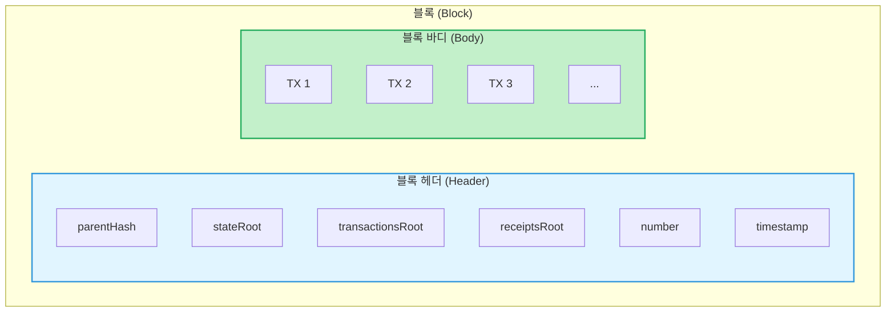
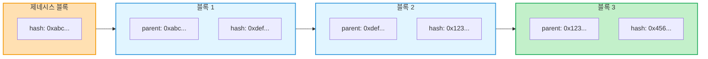
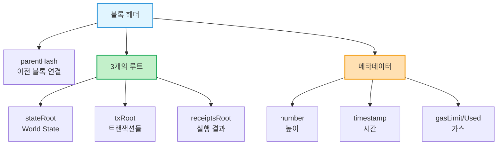
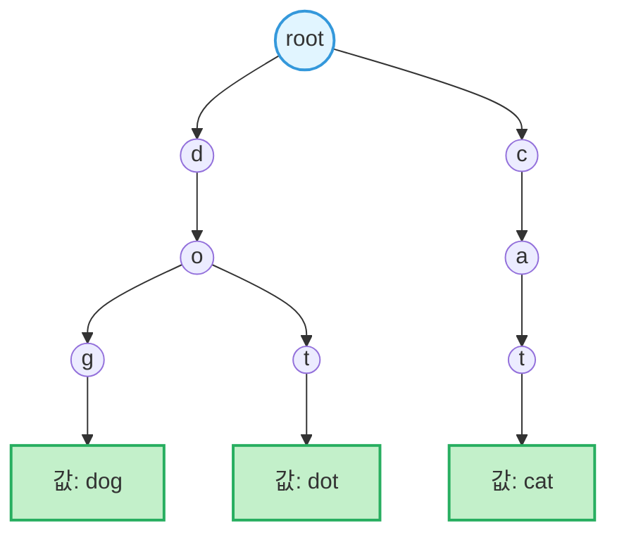
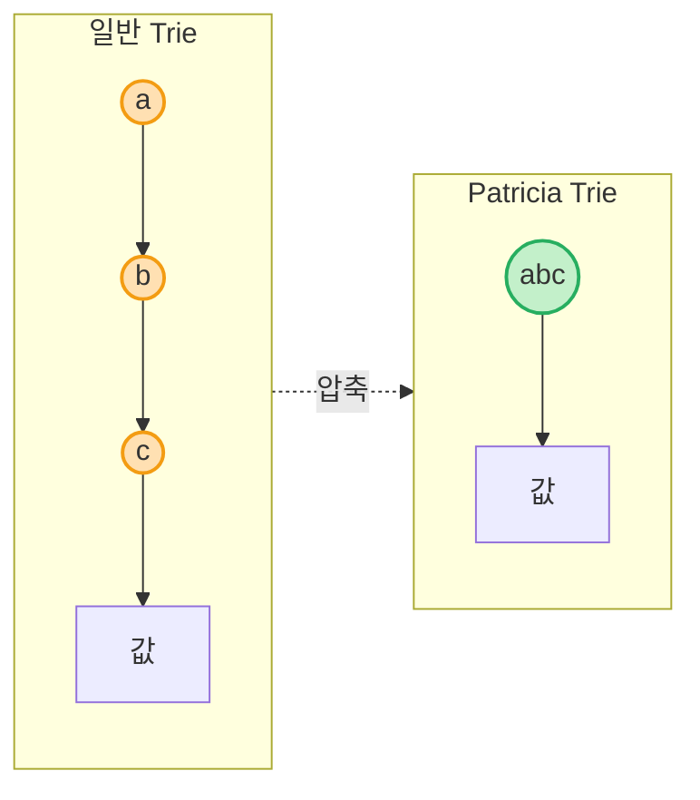
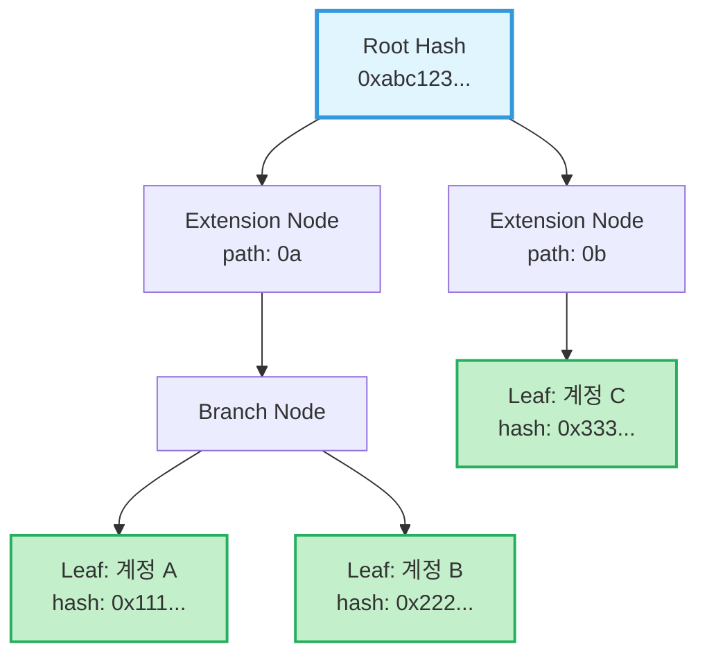
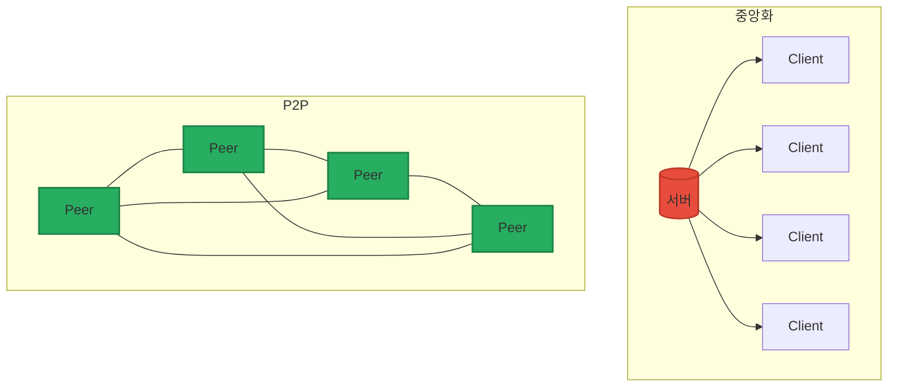
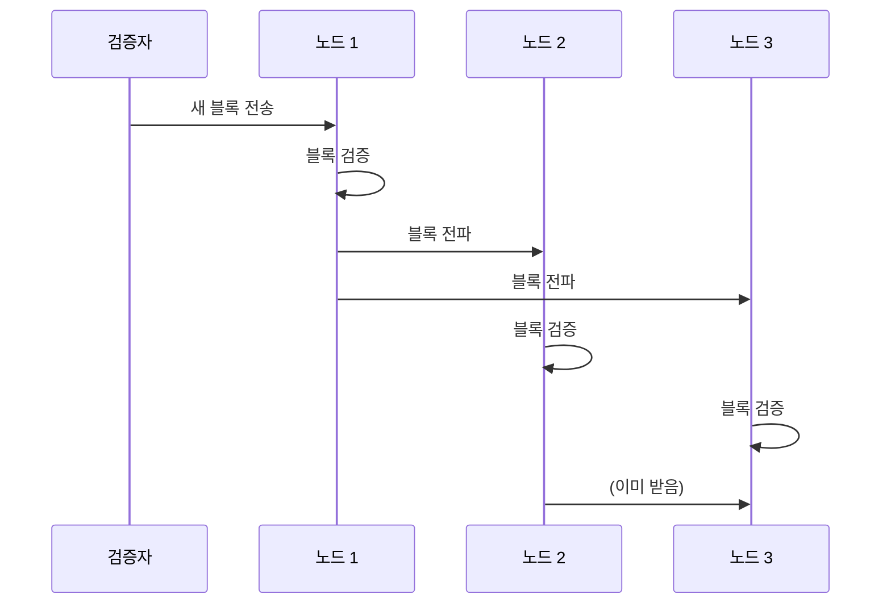
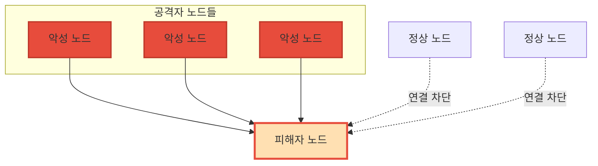

<!-- _class: title -->
# 4주차: Network/Block

블록 구조, 체인 연결, MPT

---

## 학습 목표

이 주차를 마치면:

- **블록**의 구조와 헤더 필드를 설명할 수 있습니다
- 블록이 **체인**으로 연결되는 방식을 이해합니다
- **MPT(Merkle Patricia Trie)** 구조를 심화 학습합니다 (Week 1 복습)
- **P2P 네트워크**의 기초를 알 수 있습니다
- **보안:** 네트워크 공격을 인식할 수 있습니다

---

## 블록이란?

### "거래 묶음" - 여러 트랜잭션을 하나로 포장

**비유:** 택배 상자
- 여러 개의 물건(트랜잭션)을 하나의 상자(블록)에 담습니다
- 상자에는 배송 정보(헤더)가 붙어있습니다
- 상자들은 순서대로 연결됩니다

**블록의 구성:**
- **블록 헤더(Header):** 메타데이터
- **트랜잭션 목록:** 실제 거래들

---

<!-- _class: diagram -->
## 블록 구조



---

## 블록의 연결 방식

### parentHash로 이어지는 체인

각 블록은 **이전 블록의 해시값**을 가지고 있습니다

```
블록 N의 parentHash = 블록 N-1의 해시
```

**비유:** 도미노
- 각 도미노는 앞의 도미노와 연결됩니다
- 하나를 바꾸면 뒤의 모든 도미노가 영향받습니다

---

<!-- _class: diagram -->
## 블록 체인 시각화



---

## 왜 이렇게 연결하나요?

### 불변성(Immutability) 보장

1. **해시는 내용의 지문**입니다
2. 내용이 바뀌면 해시도 바뀝니다
3. 블록 N을 수정하면 → 해시 변경 → 블록 N+1의 parentHash 불일치

**결론:** 과거 블록을 수정하려면 그 이후 **모든 블록**을 다시 만들어야 합니다

> 이것이 블록체인이 **변조 방지**되는 이유입니다!

---

## 블록 헤더 필드 상세 (1/2)

### 핵심 필드들

| 필드 | 설명 | 비유 |
|------|------|------|
| **parentHash** | 이전 블록의 해시 | 이전 택배 송장번호 |
| **stateRoot** | World State의 루트 | 전화번호부 목차 |
| **transactionsRoot** | 트랜잭션들의 루트 | 내용물 목록 |
| **receiptsRoot** | 실행 결과들의 루트 | 배송 결과 |

---

## 블록 헤더 필드 상세 (2/2)

### 추가 필드들

| 필드 | 설명 |
|------|------|
| **number** | 블록 높이 (몇 번째 블록인지) |
| **timestamp** | 블록 생성 시간 |
| **gasLimit** | 블록에서 사용 가능한 최대 가스 |
| **gasUsed** | 실제 사용된 가스 |
| **baseFeePerGas** | 기본 가스 가격 (EIP-1559) |
| **difficulty** | 채굴 난이도 (PoS 이후 0) |

---

<!-- _class: diagram -->
## 헤더 필드 관계



---

## MPT 심화: Week 1 복습

### 1주차에서 배운 것

- **World State** = 모든 계정의 현재 상태
- **MPT**로 저장됨 = "빠르고 안전한 전화번호부"

이제 MPT가 **어떻게** 동작하는지 자세히 알아봅시다!

---

## Trie란? (1단계)

### "단어를 저장하는 트리"

**Trie**는 키를 한 글자씩 따라가며 값을 찾는 자료구조입니다

```
dog → d → o → g → [값]
dot → d → o → t → [값]
```

**특징:**
- 공통 접두사(prefix)를 공유합니다
- 검색이 빠릅니다: O(키 길이)

---

<!-- _class: diagram -->
## Trie 구조



---

## Patricia Trie (2단계)

### "경로 압축으로 공간 절약"

일반 Trie의 문제: 긴 키에 노드가 너무 많아집니다

**Patricia Trie 해결책:**
- 단일 자식 노드들을 **압축**합니다
- `a → b → c` 대신 `abc` 하나의 노드로

**비유:** 주소 단축
- "서울시 강남구 테헤란로 123" → "강남 테헤란로 123"

---

<!-- _class: diagram -->
## Patricia Trie 압축



---

## Merkle Trie (3단계)

### "해시로 무결성 검증"

**Merkle Tree**의 아이디어를 결합합니다:
- 각 노드의 해시 = 자식들의 해시 조합
- **루트 해시**만 알면 전체 무결성 검증 가능

**비유:** 봉인된 상자들
- 상자 안에 상자, 그 안에 또 상자
- 가장 바깥 봉인만 확인하면 내부 변조 감지

---

<!-- _class: diagram -->
## Merkle Patricia Trie (MPT)



---

## MPT의 3가지 노드 타입

### Extension, Branch, Leaf

| 노드 타입 | 역할 | 비유 |
|-----------|------|------|
| **Extension** | 공통 경로 압축 | 고속도로 |
| **Branch** | 16개 분기점 (0-f) | 교차로 |
| **Leaf** | 실제 데이터 저장 | 목적지 |

> 이더리움 주소는 16진수이므로 Branch 노드는 16개 자식을 가질 수 있습니다

---

## 왜 MPT를 사용하나요?

### 이더리움에서의 활용

1. **효율적 검색:** 주소로 계정 빠르게 찾기
2. **공간 절약:** Patricia 압축으로 저장 효율
3. **변조 방지:** Merkle 해시로 무결성 검증
4. **Light Client 지원:** 전체 데이터 없이 검증 가능

**사용처:**
- State Trie (World State)
- Transaction Trie
- Receipt Trie

---

## P2P 네트워크란?

### "중앙 서버 없이 친구들끼리 직접 연결"

**중앙화 네트워크:**
```
모든 사용자 → 중앙 서버 → 모든 사용자
```

**P2P(Peer-to-Peer) 네트워크:**
```
사용자 ↔ 사용자 ↔ 사용자 ↔ ...
```

**장점:**
- 단일 실패 지점 없음
- 검열 저항성
- 분산된 신뢰

---

<!-- _class: diagram -->
## 네트워크 토폴로지 비교



---

## 이더리움 노드 종류

### Full, Light, Archive

| 노드 타입 | 저장 데이터 | 용도 |
|-----------|-------------|------|
| **Full Node** | 최근 블록 + 현재 상태 | 일반 검증 |
| **Light Node** | 헤더만 | 지갑, 모바일 |
| **Archive Node** | 모든 역사적 상태 | 분석, 탐색기 |

**일반 사용자:** Light Node로 충분
**DApp 개발자:** Full Node 권장
**블록 탐색기:** Archive Node 필요

---

## 블록 전파 과정

### 새 블록이 네트워크에 퍼지는 방법

1. **블록 생성:** 검증자가 새 블록 생성
2. **전파:** 연결된 피어들에게 전송
3. **검증:** 각 노드가 블록 유효성 검사
4. **저장:** 유효하면 로컬에 저장
5. **재전파:** 다른 피어들에게 전달

---

<!-- _class: diagram -->
## 블록 전파 흐름



---

<!-- _class: security -->
## 보안: Eclipse Attack

### "노드를 속여서 가짜 정보 주입"

**Eclipse Attack이란?**
- 공격자가 피해자 노드의 **모든 연결**을 장악
- 피해자는 **잘못된 블록체인** 정보를 받음

**위험:**
- 이중 지불 공격에 이용될 수 있음
- 채굴 보상 탈취
- 잘못된 트랜잭션 정보 수신

---

<!-- _class: security -->
## Eclipse Attack 시각화



---

<!-- _class: security -->
## 보안: 51% Attack

### "과반 해시파워/지분으로 체인 조작"

**51% Attack이란?**
- 네트워크의 **과반 이상**의 파워를 확보
- 자신만의 **비밀 체인**을 만들어 교체

**가능한 공격:**
- 이중 지불(Double Spending)
- 트랜잭션 검열
- 블록 재조직

> 비트코인/이더리움 같은 큰 네트워크에서는 사실상 불가능

---

<!-- _class: security -->
## 방어 방법

### 어떻게 보호할 수 있나요?

**개인 노드 운영자:**
- **다중 노드 연결:** 여러 피어와 연결 유지
- **신뢰할 수 있는 노드:** 검증된 부트노드 사용
- **노드 다양성:** 다양한 지역/운영자의 노드 연결

**네트워크 전체:**
- 충분한 분산화 (노드 수)
- 높은 해시레이트/스테이킹 양
- 지속적인 모니터링

---

<!-- _class: summary -->
## 핵심 정리

**블록 = 거래 묶음**
- 헤더(메타데이터) + 바디(트랜잭션)

**체인 = parentHash로 연결**
- 변조 시 모든 후속 블록 영향

**MPT = Trie + Patricia + Merkle**
- 효율적 검색 + 공간 절약 + 변조 방지

**P2P = 탈중앙 네트워크**
- 노드 종류: Full, Light, Archive

---

<!-- _class: summary -->
## 보안 핵심 정리

**Eclipse Attack**
- 노드 격리 → 잘못된 정보 주입
- 방어: 다중 노드 연결

**51% Attack**
- 과반 파워 → 체인 조작 가능
- 방어: 네트워크 분산화

> 항상 **다중 피어 연결**을 유지하세요!

---

## 다음 주 예고

### 5주차: PoS/Consensus

- 합의 메커니즘이란 무엇인가요?
- PoW에서 PoS로 왜 전환했나요?
- 검증자(Validator)는 어떻게 동작하나요?
- RANDAO와 슬래싱은 무엇인가요?

**준비물:** 4주차 내용 복습

---

## 참고 자료

### 이번 주 학습 자료
- [explanation.md](./explanation.md) - 초보자를 위한 상세 설명
- [용어 사전](../../resources/glossary.md) - 핵심 용어 정리

### 외부 참고 자료
- [Ethereum.org - Blocks](https://ethereum.org/developers/docs/blocks)
- [Ethereum.org - Networks](https://ethereum.org/developers/docs/networks)
- [Understanding Merkle Patricia Tries](https://ethereum.org/developers/docs/data-structures-and-encoding/patricia-merkle-trie)

### 질문이 있으신가요?
Bay Slack #ethereum-questions 채널에 올려주세요!
