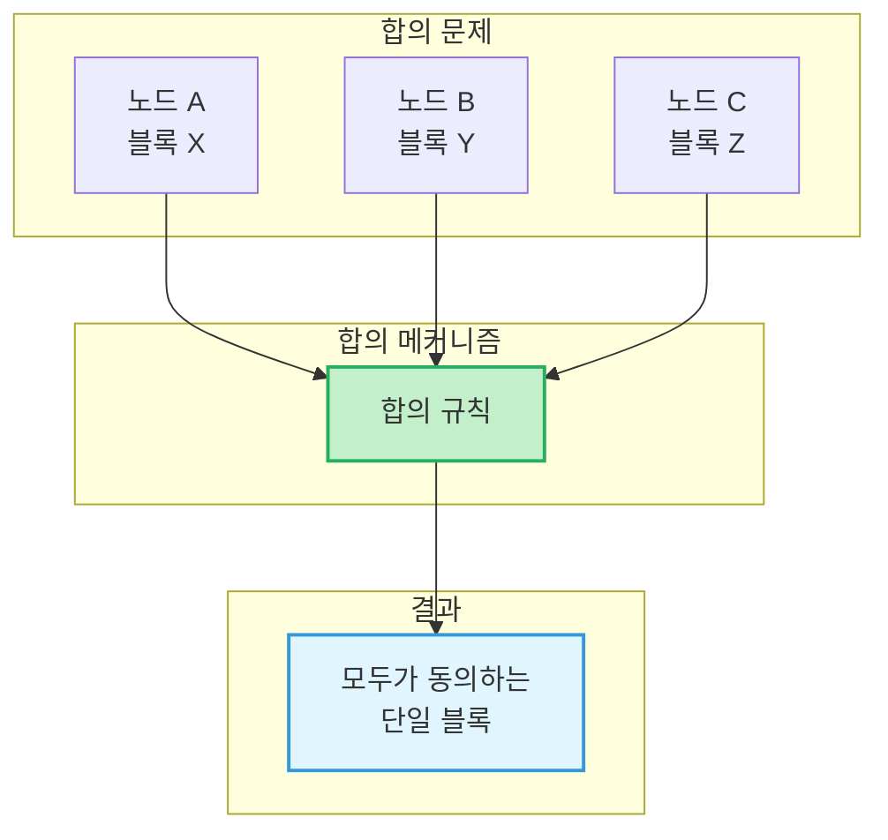
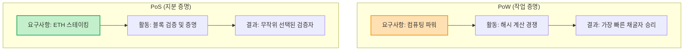
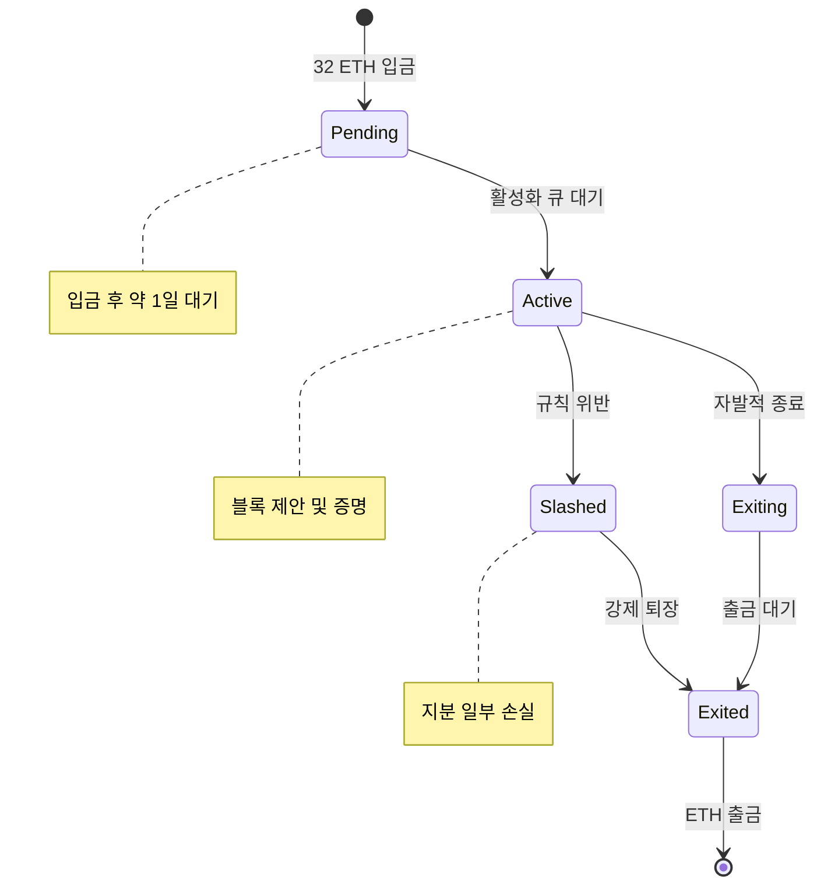
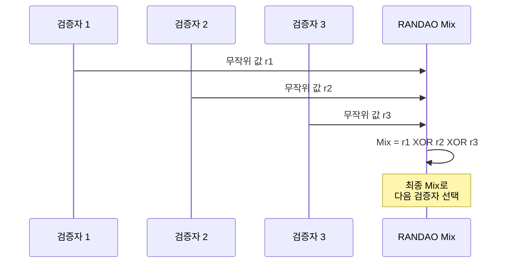
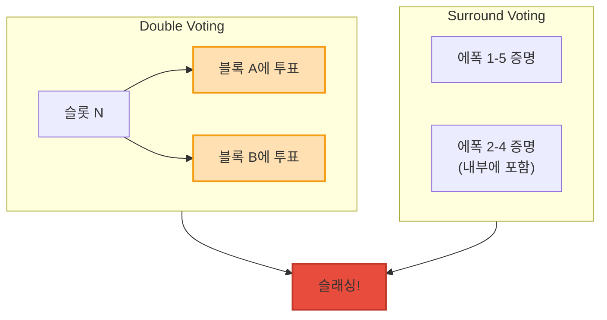

<!-- _class: title -->
# 5주차: PoS/Consensus

지분증명, 검증자, RANDAO

---

## 학습 목표

이 주차를 마치면:

- **합의 메커니즘**이 왜 필요한지 설명할 수 있습니다
- **PoW**와 **PoS**의 차이를 이해합니다
- **검증자(Validator)**의 역할을 알 수 있습니다
- **RANDAO**를 통한 무작위 선택을 이해합니다
- **슬래싱(Slashing)** 메커니즘을 알 수 있습니다

---

## 합의 메커니즘이란?

### "누구의 블록이 맞나요?"

**문제:** 여러 노드가 동시에 블록을 만들면?

- 노드 A: "블록 100은 이거야!"
- 노드 B: "아니, 블록 100은 저거야!"
- 노드 C: "둘 다 아니야!"

**해결:** 모든 노드가 **같은 규칙**으로 결정

---

<!-- _class: diagram -->
## 합의 문제 시각화

---

## Byzantine Fault Tolerance

### "배신자가 있어도 동작하는 시스템"

**비잔틴 장군 문제:**
- 여러 장군이 공격 시간을 합의해야 함
- 일부 장군은 **배신자**(거짓 메시지 전달)
- 정직한 장군들만으로 합의 가능할까?

**BFT 조건:**
- 2/3 이상이 정직하면 합의 가능
- 이더리움도 이 원리를 사용합니다

---

## PoW: 작업 증명

### "가장 많이 일한 사람이 승리"

**Proof of Work(작업 증명):**
- 어려운 **수학 문제**를 풀어야 블록 생성
- 문제를 가장 먼저 푼 노드가 보상
- 비유: **금 채굴**

**장점:**
- 검증된 보안 (비트코인 15년+)

**단점:**
- 막대한 **에너지 소비**
- 채굴 장비 집중화

---

## PoS: 지분 증명

### "가진 만큼 책임지는 투표"

**Proof of Stake(지분 증명):**
- ETH를 **스테이킹**하여 검증자가 됨
- 무작위로 블록 제안자 선택
- 비유: **주주 총회 투표**

**장점:**
- 에너지 절약 (99.95%+ 감소)
- 더 높은 탈중앙화 가능성

**단점:**
- 상대적으로 새로운 방식

---

<!-- _class: diagram -->
## PoW vs PoS 비교

---

## The Merge: 역사적 전환

### 2022년 9월 15일

**The Merge란?**
- 이더리움이 PoW에서 PoS로 전환
- 에너지 소비 **99.95%** 감소
- 블록체인 역사상 가장 큰 업그레이드

**전환 과정:**
- Beacon Chain 출시 (2020.12)
- 테스트넷 검증
- Merge 완료 (2022.9.15)

---

## 검증자(Validator)란?

### "이더리움의 투표권자"

**검증자 되기:**
- **32 ETH**를 스테이킹 (보증금)
- 검증자 소프트웨어 실행
- 네트워크에 참여

**비유:** 배심원단
- 보증금(32 ETH) = 성실히 참여하겠다는 약속
- 블록 검증 = 판결에 참여
- 보상 = 수고비

---

<!-- _class: diagram -->
## 검증자 생애주기

---

## 검증자의 두 가지 역할

### 블록 제안자 & 증명자

**블록 제안자(Proposer):**
- 슬롯당 **1명** 선택됨
- 새 블록을 생성하고 제안
- 성공 시 추가 보상

**증명자(Attester):**
- 제안된 블록을 **검증**
- 유효하면 증명(attestation) 제출
- 매 에폭마다 역할 수행

---

## 검증자 보상과 패널티

### 인센티브 구조

**보상 (연간 약 4-7% APR):**
- 블록 제안 보상
- 증명 보상
- 동기화 위원회 보상

**패널티:**
- 오프라인 시 소액 패널티
- 잘못된 증명 시 패널티
- 악의적 행위 시 **슬래싱**

---

## RANDAO란?

### "공정한 추첨 시스템"

**문제:** 검증자 선택이 예측 가능하면?
- 공격자가 미리 준비 가능
- 선택된 검증자 공격 가능

**RANDAO 해결책:**
- 각 검증자가 **무작위 값**을 제출
- 모든 값을 **XOR**로 조합
- 결과를 예측할 수 없음

---

<!-- _class: diagram -->
## RANDAO 동작 원리

---

## RANDAO의 특성

### 왜 안전한가?

1. **예측 불가:** 마지막 기여자도 결과 예측 불가
2. **편향 저항:** 일부가 값을 숨겨도 완전 통제 불가
3. **검증 가능:** 모든 기여가 블록에 기록됨

**한계:**
- 마지막 기여자가 결과를 **약간** 조작 가능
- 하지만 비용(보상 포기)이 이익보다 큼

---

## 슬래싱(Slashing)이란?

### "규칙 위반자에 대한 처벌"

**슬래싱 대상 행위:**
1. **Double Voting:** 같은 슬롯에 두 번 투표
2. **Surround Voting:** 이전 증명을 둘러싸는 투표

**처벌:**
- 스테이킹된 ETH 일부 **소각**
- 검증자 자격 **박탈**
- 강제 퇴장

---

<!-- _class: diagram -->
## 슬래싱 조건

---

## 슬래싱의 심각성

### 규모에 따른 처벌

**기본 슬래싱:**
- 최소 1/32 ETH 손실 (약 1 ETH)

**상관 슬래싱:**
- 동시에 많은 검증자가 슬래싱되면 추가 패널티
- 최대 **전체 지분 손실** 가능

**이유:** 대규모 공격 억제
- 개인 실수는 가벼운 처벌
- 조직적 공격은 치명적 처벌

---

<!-- _class: summary -->
## 핵심 정리

**합의 메커니즘 = 모두가 동의하는 규칙**
- Byzantine Fault Tolerance (2/3+)

**PoS = 지분 증명**
- 32 ETH 스테이킹으로 검증자 참여
- PoW 대비 99.95% 에너지 절약

**검증자의 역할**
- 블록 제안 (Proposer)
- 블록 증명 (Attester)

---

<!-- _class: summary -->
## 핵심 정리 (계속)

**RANDAO = 공정한 무작위 선택**
- 각 검증자의 기여를 조합
- 예측 불가능한 결과 생성

**슬래싱 = 악의적 행위 처벌**
- Double voting, Surround voting
- 스테이킹 손실 + 강제 퇴장

> 다음 주에 Beacon Chain과 Finality를 배웁니다!

---

## 다음 주 예고

### 6주차: Beacon Chain/Finality

- Beacon Chain이란 무엇인가요?
- Slot과 Epoch은 무엇인가요?
- Finality(최종성)는 어떻게 달성되나요?
- Casper FFG와 LMD-GHOST는 무엇인가요?

**준비물:** 5주차 PoS/Validator 개념 복습

---

## 참고 자료

### 이번 주 학습 자료
- [explanation.md](./explanation.md) - 초보자를 위한 상세 설명
- [용어 사전](../../resources/glossary.md) - 핵심 용어 정리

### 외부 참고 자료
- [Ethereum.org - Proof of Stake](https://ethereum.org/developers/docs/consensus-mechanisms/pos)
- [Ethereum.org - The Merge](https://ethereum.org/roadmap/merge)
- [Ethereum.org - Validators](https://ethereum.org/staking)

### 질문이 있으신가요?
Bay Slack #ethereum-questions 채널에 올려주세요!
