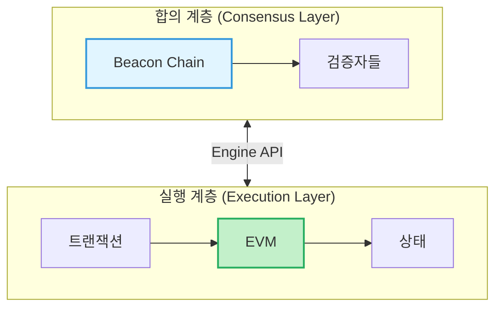
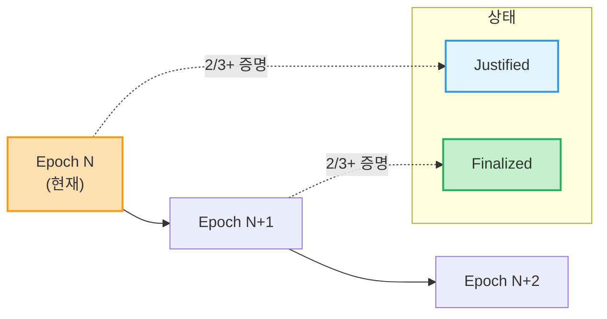
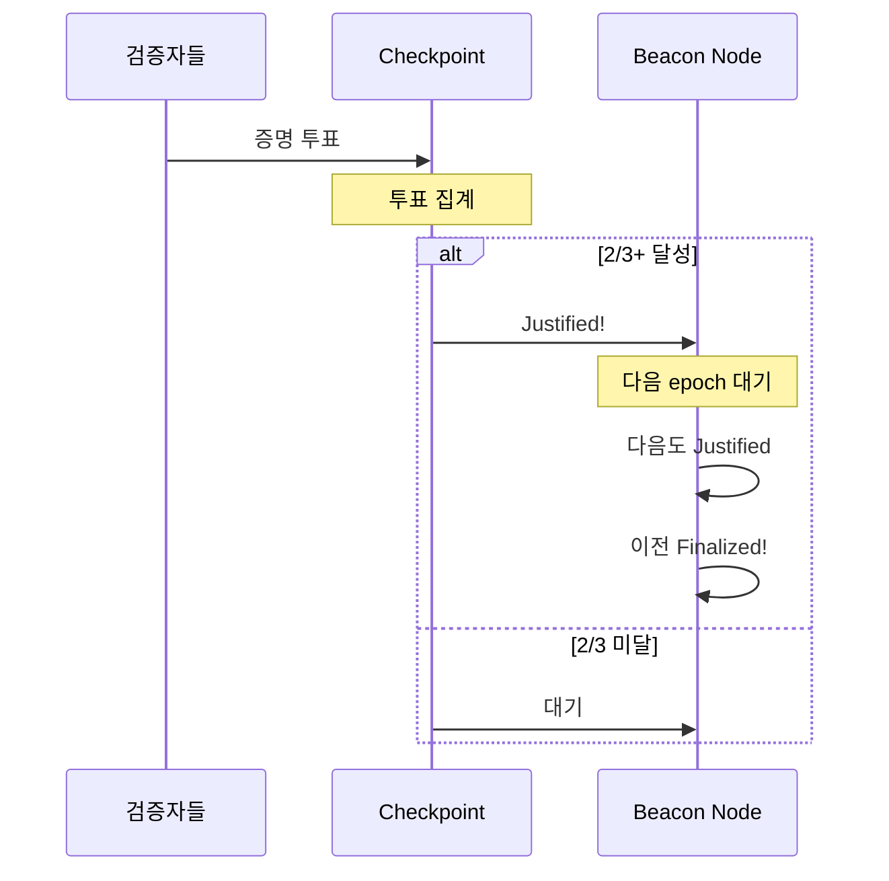
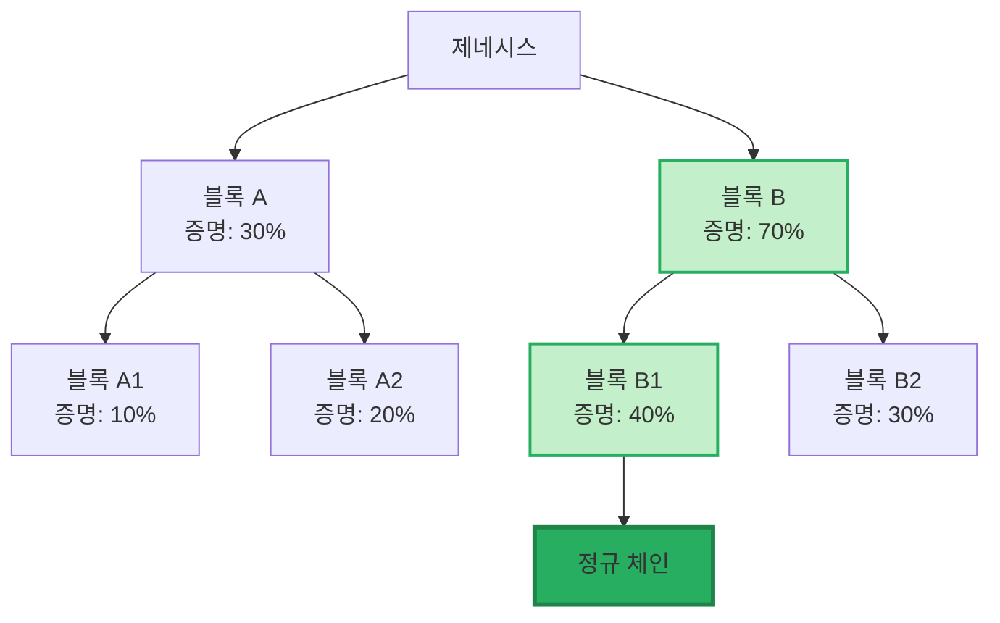
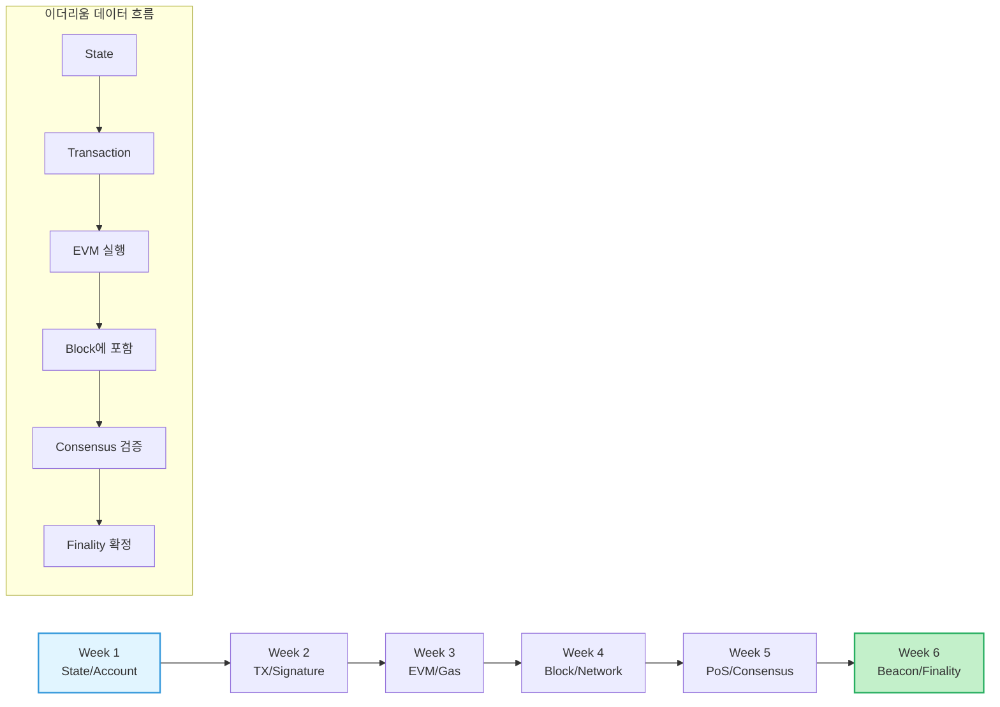

<!-- _class: title -->
# 6주차: Beacon Chain/Finality

최종성, 포크, 캐스퍼

---

## 학습 목표

이 주차를 마치면:

- **Beacon Chain**의 역할을 설명할 수 있습니다
- **Slot**과 **Epoch**의 개념을 이해합니다
- **Finality(최종성)**가 무엇인지 알 수 있습니다
- **Casper FFG** 메커니즘을 이해합니다
- **Fork Choice(LMD-GHOST)**를 설명할 수 있습니다

---

## Beacon Chain이란?

### "이더리움의 합의 통제탑"

**Beacon Chain:**
- 이더리움 **합의 계층(Consensus Layer)**
- 검증자 관리 및 조정
- 블록 최종성 결정

**비유:** 공항 관제탑
- 비행기(트랜잭션)의 이착륙(처리)을 조정
- 충돌(충돌하는 블록)을 방지
- 전체 일정(블록 생성)을 관리

---

<!-- _class: diagram -->
## Beacon Chain 아키텍처



---

## 두 가지 계층

### Execution Layer + Consensus Layer

**실행 계층 (Execution Layer):**
- 트랜잭션 처리
- 스마트 컨트랙트 실행
- 상태(State) 관리

**합의 계층 (Consensus Layer):**
- 검증자 관리
- 블록 순서 결정
- 최종성 보장

**통신:** Engine API로 연결됨

---

## Slot이란?

### "12초 단위의 시간 간격"

**Slot:**
- 블록이 생성될 수 있는 **시간 창**
- 각 슬롯 = **12초**
- 슬롯마다 **1명**의 블록 제안자 선택

**빈 슬롯:**
- 제안자가 오프라인이면 슬롯이 빌 수 있음
- 다음 슬롯에서 계속 진행

---

## Epoch이란?

### "32 슬롯의 묶음"

**Epoch:**
- **32 slots** = 1 epoch
- 32 × 12초 = **6.4분**

**Epoch의 역할:**
- 검증자 역할 재배정
- Finality 체크포인트
- 보상/패널티 정산

---

<!-- _class: diagram -->
## Epoch/Slot 타임라인

```mermaid
gantt
    title Epoch 구조 (6.4분)
    dateFormat X
    axisFormat %s

    section Epoch N
    Slot 0     :a1, 0, 12
    Slot 1     :a2, 12, 24
    Slot 2     :a3, 24, 36
    ...        :a4, 36, 372
    Slot 31    :a5, 372, 384

    section Checkpoint
    Epoch N 끝 :milestone, 384, 0
```



**1 Epoch = 32 Slots = 384초 = 6.4분**

---

## Checkpoint란?

### "에폭 시작점의 블록"

**Checkpoint:**
- 각 에폭 **첫 번째 슬롯**의 블록
- Finality 결정에 사용
- Justification의 기준점

**비유:** 버스 정류장
- 정기적으로 확인하는 지점
- 여기까지는 확정(finalize)됨

---

## Finality(최종성)란?

### "되돌릴 수 없는 확정"

**문제:** 블록이 추가되어도 재조직 가능성 있음

**Finality 해결:**
- 특정 블록이 **절대 변경되지 않음**을 보장
- 1/3 이상의 지분이 슬래싱되지 않는 한 번복 불가

**비유:** 계약서 공증
- 공증 전: 변경 가능
- 공증 후: 법적 구속력 (되돌리기 어려움)

---

<!-- _class: diagram -->
## Finality 타임라인



**Justified → Finalized: 2 Epochs (약 13분)**

---

## Justification과 Finalization

### 2단계 확정 과정

**1단계: Justification (정당화)**
- Epoch의 checkpoint가 **2/3+ 검증자** 증명을 받음
- "이 블록이 유효해 보임"

**2단계: Finalization (최종화)**
- Justified된 checkpoint의 **다음 epoch**도 justified되면
- 이전 checkpoint가 **finalized**됨

**결과:** 약 **2 epoch (12.8분)** 후 finality

---

## 왜 2단계인가?

### 안전성과 활성성의 균형

**빠른 finality의 위험:**
- 네트워크 지연으로 잘못된 블록 확정 가능
- 되돌리기 불가능 → 치명적

**2단계의 장점:**
- 첫 번째 확인: "이게 맞아 보여"
- 두 번째 확인: "확실해, 확정!"
- 오류 복구 기회 제공

---

## Casper FFG란?

### "Friendly Finality Gadget"

**Casper FFG:**
- 이더리움의 **finality 메커니즘**
- 2017년 Vitalik Buterin 등이 제안
- PoS와 결합하여 finality 제공

**핵심 규칙:**
- 2/3 이상 검증자 동의 필요
- Slashing으로 악의적 행위 방지
- 안전성(Safety) 최우선

---

<!-- _class: diagram -->
## Casper 투표 흐름



---

## Casper의 Slashing 규칙

### 안전성 보장

**슬래싱 조건 (복습):**
1. **Double voting:** 같은 epoch에 두 번 투표
2. **Surround voting:** 이전 투표를 둘러싸는 투표

**수학적 보장:**
- 충돌하는 두 블록이 모두 finalize되려면
- 1/3+ 검증자가 slashing 조건 위반 필수
- 즉, 1/3+ 지분이 소각됨

---

## Fork Choice란?

### "어떤 체인을 따를까?"

**문제:** 여러 유효한 체인이 있을 때

```
        ┌── 블록 A
블록 X ─┤
        └── 블록 B
```

**어느 것이 "정답"인가?**

---

## LMD-GHOST

### "Latest Message Driven - GHOST"

**LMD-GHOST:**
- **L**atest **M**essage **D**riven
- **G**reediest **H**eaviest **O**bserved **S**ub**t**ree

**규칙:**
- 각 검증자의 **가장 최근 증명** 사용
- 가장 많은 증명을 받은 **서브트리** 선택

---

<!-- _class: diagram -->
## Fork Choice 시각화



---

## Fork Choice + Finality

### 두 메커니즘의 조화

**LMD-GHOST:** 실시간 체인 선택
- "지금 어느 블록을 빌드해야 하나?"
- 빠른 반응, 일시적

**Casper FFG:** 최종 확정
- "이 블록은 영원히 변하지 않아"
- 느리지만 확실

**조합:** 빠른 사용성 + 강한 보안

---

<!-- _class: diagram -->
## 6주 커리큘럼 총정리



---

<!-- _class: summary -->
## 핵심 정리

**Beacon Chain = 합의 통제탑**
- 검증자 관리, 블록 순서, 최종성

**Slot & Epoch**
- Slot = 12초, Epoch = 32 slots (6.4분)

**Finality = 되돌릴 수 없는 확정**
- Justified → Finalized (2 epochs)
- 1/3+ 슬래싱 없이 번복 불가

---

<!-- _class: summary -->
## 핵심 정리 (계속)

**Casper FFG = Finality 메커니즘**
- 2/3+ 검증자 동의 필요
- Slashing으로 안전성 보장

**LMD-GHOST = Fork Choice 규칙**
- 가장 무거운 서브트리 선택
- 실시간 체인 선택

---

## 다음 단계

### 축하합니다! 6주 이론 과정 완료!

**배운 것들:**
- State, Account, Transaction
- EVM, Gas, Block, Network
- PoS, Consensus, Beacon Chain, Finality

**다음 과정:**
- 개발 실습 (스마트 컨트랙트)
- 나만의 DApp 만들기
- Foundry로 테스트하기

---

## 참고 자료

### 이번 주 학습 자료
- [explanation.md](./explanation.md) - 초보자를 위한 상세 설명
- [용어 사전](../../resources/glossary.md) - 핵심 용어 정리

### 외부 참고 자료
- [Ethereum.org - Beacon Chain](https://ethereum.org/roadmap/beacon-chain)
- [Ethereum.org - Finality](https://ethereum.org/developers/docs/consensus-mechanisms/pos/gasper)
- [Casper FFG Paper](https://arxiv.org/abs/1710.09437)

### 질문이 있으신가요?
Bay Slack #ethereum-questions 채널에 올려주세요!
